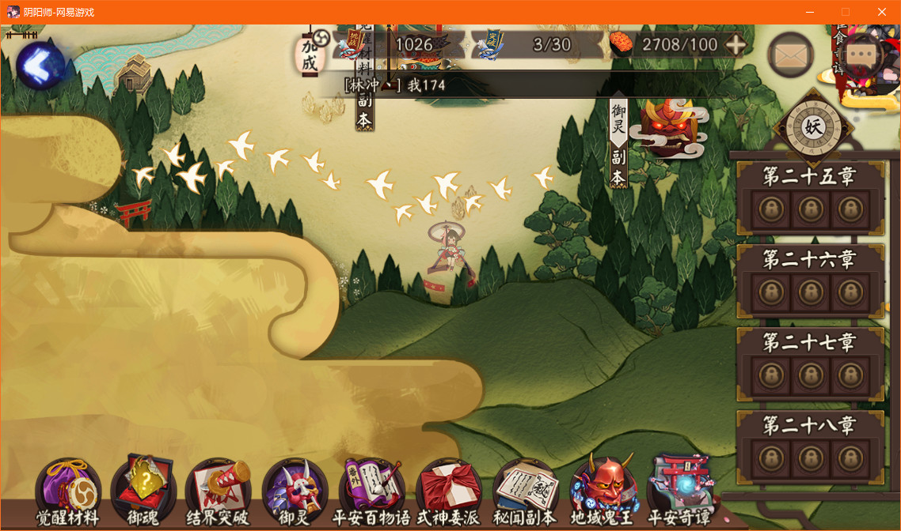
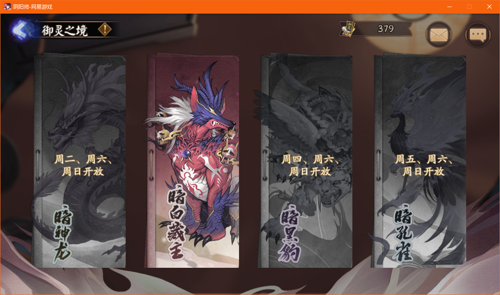
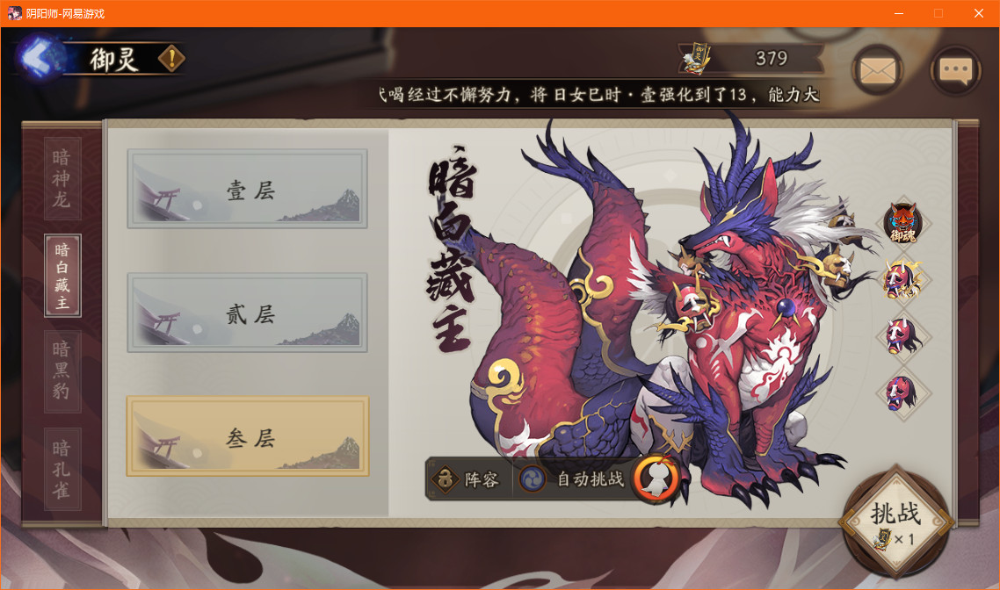

[TOC]

# 1. 软件整体设计思路

## 1.1. 基础要素

1. 获取阴阳师窗口的句柄信息（暂只Windows系统）
2. 鼠标自动点击
3. 图像自动识别，给自动点击提供坐标信息

以御灵为例，假设从庭院开始，要完成一次御灵，我们的执行步骤如下：**探索 -> 御灵 -> 选择类型 -> 选择层数 -> 挑战**  
不考虑需要更换式神的情况下，如果我们要自动进行下一轮的挑战，需要执行的步骤：**成功/失败 -> 领达摩奖励 -> 挑战**  
合并起来就是这样一个流程：  
搜索 -> 御灵 -> 选择类型 -> 选择层数 -> 挑战 -> 准备 -> 成功/失败 -> 领达摩奖励 -> 挑战 -> ...  

## 1.2. win32gui窗体库

我们主要用到的功能：

1. 获取阴阳师游戏的窗体。
2. 修改阴阳师游戏的大小。修改大小是因为图像匹配时不因为不同机器可能初始的游戏窗体大小不一样，这样我们不好去适配所有的分辨率，干脆统一大小。
3. 获取游戏窗体的坐标信息

特别注意，修改大小时需要**管理员权限**  

### 1.2.1. 安装相应的库

```shell
pip install pywin32
```

### 1.2.2. 获取窗体

```python
# -*- coding: utf-8 -*-

# %%
import win32gui
import win32con
import logging

# %% 获取阴阳师窗口的句柄信息
logging.basicConfig(level=logging.DEBUG)
win_name = '阴阳师-网易游戏'
win_handler = win32gui.FindWindow(0, win_name)  # 获取窗口句柄
if win_handler == 0:
    logging.error('请确认游戏是否已经开启')
    exit()

x_top, y_top, x_bottom, y_bottom = \
    win32gui.GetWindowRect(win_handler)
win_width = x_bottom - x_top
win_height = y_bottom - y_top
logging.debug('捕获到程序：{0},({1},{2}),{3},{4}'.format(win_name, x_top, y_top,
                                                   win_width, win_height))

# %% 调整窗体大小，无法调整时会抛异常
new_width = 1152
new_height = 679
try:
    win32gui.SetWindowPos(win_handler, win32con.HWND_NOTOPMOST, x_top, y_top,
                          new_width, new_height, win32con.SWP_SHOWWINDOW)
except Exception as error:
    raise ('请确认你拥有管理员权限，否则无法重新设置大小，msg:{0}'.format(error))
```

## 1.3. 自动点击的第三方库

我们主要用到的功能：  

1. 根据坐标信息点击左键
2. 根据坐标信息连续左键两次
3. 移动到具体位置，主要为了配合拖拉
4. 拖拉（长按一个位置并拖拉），刷御魂时可能需要拉到最后。刷困28时如果界面中没有怪时也要拖拉

这个库就不详细展开了，给出下面几个链接供大家需要的时候查阅  

- pyautogui的中文接口说明，<https://blog.csdn.net/ibiao/article/details/77859997>
- pyautogui的英文接口说明，<https://pyautogui.readthedocs.io/en/latest/>
- pyautogui的github链接，<https://github.com/asweigart/pyautogui>

```python
def click_loc_exact(self, click_x, click_y, times=-1, interval=0.5):
    if times == -1:
        times = randint(2, 3)
    self.display_msg('点击位置：({0},{1},{2},{3})'.format(
        click_x, click_y, interval, times))
    pyautogui.click(click_x, click_y, times, interval, button='left')

def click_loc_inc(self, inc_x, inc_y, times=-1, interval=0.5):
    return self.click_loc_exact(self.x_top + inc_x, self.y_top + inc_y,
                                times, interval)

def click_loc_one(self, loc):
    self.click_loc(loc, 1)

def click_loc_twice(self, loc):
    self.click_loc(loc, 2)

def move_loc_exact(self, move_x, move_y, interval=0):
    interval = interval if interval != 0 else uniform(0.1, 0.5)
    self.display_msg('移动位置到：({0},{1})'.format(move_x, move_y))
    pyautogui.moveTo(move_x, move_y, duration=interval)

def move_loc_inc(self, move_x, move_y, interval=0):
    '''移动相对于主界面的相对位置'''
    interval = interval if interval != 0 else uniform(0.1, 0.5)
    self.display_msg('移动位置到：({0},{1})'.format(move_x, move_y))
    pyautogui.moveTo(self.x_top + move_x,
                        self.y_top + move_y,
                        duration=interval)

def scroll_loc_exact(self, clicks, move_x=0, move_y=0):
    '''滚动接口调用之后点击位置会不准
        clicks 参数表示滚动的格数。
        正数则页面向上滚动
        负数则向下滚动
    '''
    self.display_msg('滚动鼠标幅度：{0}'.format(clicks))
    pyautogui.scroll(clicks=clicks, x=move_x, y=move_y)

def dragRel_loc_exact(self, x_offset, y_offset, du=0.5):
    '''
        @x_offset： 正数为按住一个点向右拖动，负数按住一个点向左拖动
        @y_offset： 正数为按住一个点向下拖动，负数按住一个点向上拖动，大小表示拖动幅度
        @du, 表示拖动使用的时间间隔滚动
    '''
    self.display_msg('拖动鼠标幅度：{0}, {1}'.format(x_offset, y_offset))
    pyautogui.dragRel(x_offset, y_offset, duration=du)
```

## 1.4. 御灵实现详细讲解

### 1.4.1. 庭院进入到挑战

探索 -> 御灵 -> 选择类型，这几个操作都只需要点击一下鼠标就可以进入下一步  




### 1.4.2. 御魂类型

御魂类型总共有四种，所以这一层的图片至少是要识别四和，分别对应 ['dragon', 'fox', 'leopard', 'phenix']  



### 1.4.3. 挑战界面含有层数和挑战动作

选择层数中含有两个动作：选择层数和点击挑战，所以这里要做两步操作：  

1. 选择层数，如果已经选择三层则不再重复选择
2. 点击挑战



### 1.4.4. 准备

不考虑更换式神，直接进入准备  


### 1.4.5. 结算奖励

结算和奖励分两个界面，结算是胜利和失败，奖励是达摩出现之后的界面。新引擎的话从结算进入奖励几乎是没有延迟，所以不需要特殊处理，旧引擎需要点击，否则很慢。奖励界面需要**连点两次**才能快速完成  


### 1.4.6. 循环准入和循环中

再次看下整个步骤过程：  
搜索 -> 御灵 -> 选择类型 -> 选择层数 -> 挑战 -> 准备 -> 成功/失败 -> 领达摩奖励 -> 挑战 -> ...  

把同一界面的归为同一级的话，变成如下步骤：  

搜索 -> 御灵 -> 选择类型 -> （选择层数 -> 挑战） -> 准备 -> 成功/失败 -> 领达摩奖励 -> （选择层数 -> 挑战）-> ...  

再把循环分为循环准入和循环中的话，变成两个大的阶段：  

- 循环准入判断
  - 搜索 -> 御灵 -> 选择类型 -> （选择层数 -> 挑战）
- 循环中
  - （选择层数 -> 挑战） -> 准备 -> 成功/失败 -> 领达摩奖励 -> （选择层数 -> 挑战）

## 1.5. 程序设计主体分析

所以我们设计的程序逻辑应该就如下一个流程。  

```python
def run(self):
    self.auto_type = 'Yuling'

    ret = self.get_window_handler()
    if ret is False:
        return

    ret = self.resize_win_size(1152, 679)
    # ret = self.resize_win_size()
    if ret is False:
        return

    if len(self.ims) == 0:
        self.display_msg('截图信息加载失败')
        return

    self.display_msg('正在尝试进入循环挑战状态')
    if self.goto_loop():
        self.loop()
```

其中将循环准入和循环中的状态分别列出来  

```python
stages_prepare = [
    'search', 'yuling', 'dragon', 'fox', 'leopard', 'phenix', 'layer3', 'fight'
]
stages_loop = ['reward_accept', 'fight', 'prepare', 'victory', 'fail', 'award']
```

## 1.6. 循环准入

我们利用状态机的设计思想（加载截图信息的后续再展开）。这里我们就认为我们已经把图片都加载进来了。我们判断当前阴阳师界面的状态在御灵的准入状态中，判断的逻辑大体如下：  

```python
found = False
key = ''
im_yys = self.screenshot()
for key in stages_prepare:
    loc = self.locate_im(self.ims[key], im_yys)
    if loc is not None:
        found = True
        break
if found is False:
    # 此处判断是否已经在循环，可以增强稳定性
    if self.already_in_loop():
        return True
    time.sleep(1)
    continue
```

贴出准入循环的整个函数如下：  

```python
def goto_loop(self):
    # 此处判断是否已经在循环，可以显著提高效率
    if self.already_in_loop():
        return True

    cur_check_times = 0
    last_state = ''
    layer3_reentry_times = 0
    while self.stop is False and cur_check_times < 20:
        cur_check_times += 1
        if cur_check_times % 5 == 0:
            self.display_msg('正在进行第{0}次尝试：'.format(cur_check_times))

        found = False
        key = ''
        im_yys = self.screenshot()
        for key in stages_prepare:
            loc = self.locate_im(self.ims[key], im_yys)
            if loc is not None:
                found = True
                break
        if found is False:
            # 此处判断是否已经在循环，可以增强稳定性
            if self.already_in_loop():
                return True
            time.sleep(1)
            continue

        self.display_msg('状态切换：{0} -> {1}'.format(last_state, key))
        if key in ['search', 'yuling']:
            self.display_msg('点击：{0}进入下一步'.format(key))
            self.click_loc_one(loc)
        elif key in ['dragon', 'fox', 'leopard', 'phenix']:
            # 说明当前已经进入到了选择类型的界面
            loc_tmp = None
            im_yys = self.screenshot()
            fight_type = self.config.get('type', 'leopard')
            if fight_type == 'dragon':
                loc_tmp = self.locate_im(self.ims['dragon'], im_yys)
            elif fight_type == 'fox':
                loc_tmp = self.locate_im(self.ims['fox'], im_yys)
            elif fight_type == 'leopard':
                loc_tmp = self.locate_im(self.ims['leopard'], im_yys)
            elif fight_type == 'phenix':
                loc_tmp = self.locate_im(self.ims['phenix'], im_yys)
            if loc_tmp:
                self.display_msg('点击：{0}进入下一步'.format(fight_type))
                self.click_loc_one(loc_tmp)
            else:
                self.display_msg('匹配不到状态：{0}'.format(fight_type))
        elif key == 'layer3':
            # 重入2次确保可以点击成功
            if layer3_reentry_times < 1:
                self.display_msg('点击：{0}进入下一步'.format('layer3'))
                layer3_reentry_times += 1
                self.click_loc_one(loc)
            else:
                loc_tmp = self.locate_im(self.ims['fight'])
                if loc_tmp:
                    # 说明当前已经进入到了选择类型的界面
                    self.display_msg('点击：{0}进入下一步'.format('fight'))
                    time.sleep(1)
                    return True
        last_state = key
        time.sleep(1)
    self.display_msg('未能进入到循环状态，正在退出')
    return False
```

## 1.7. 循环中

同准入循环的设计思路，也是使用状态机的思路  

```python
def loop(self):
    total_times = self.config.get('total_times', 200)
    cur_loop_times = 0
    last_state = ''
    not_found_times = 0
    while self.stop is False and cur_loop_times < total_times:
        found = False
        key = ''
        im_yys = self.screenshot()
        # 此处要改成对应的loop结构体
        for key in stages_loop:
            loc = self.locate_im(self.ims[key], im_yys)
            if loc is not None:
                found = True
                break
        if found is False:
            not_found_times += 1
            if not_found_times > 100:
                self.display_msg('超过100次未匹配，正在退出')
                self.stop = True
                break
            elif not_found_times > 30:
                self.display_msg('未匹配到状态，休眠{0}秒'.format(not_found_times))
                time.sleep(not_found_times)
            else:
                time.sleep(1.5)  # 常规情况下，休眠1.5秒
            continue
        else:
            not_found_times = 0  # 重新将失败记录改为0

        # stages_loop = ['fight', 'prepare', 'victory', 'fail', 'award']
        self.display_msg('状态切换：{0} -> {1}'.format(last_state, key))
        last_state = key

        if key in ['fight', 'prepare']:
            self.display_msg('点击：{0}进入下一步'.format(key))
            self.click_loc_one(loc)
            self.move_uncover(loc)

        elif key in ['victory', 'fail', 'award']:
            self.display_msg('点击：{0}进入下一步'.format(key))
            if key == 'award':
                cur_loop_times += 1
                self.display_msg('当前进度：{0}/{1}'.format(
                    cur_loop_times, total_times))
            random_dis = randint(-10, 10)
            last_x = self.x_top + 955 + random_dis
            last_y = self.y_top + 530 + random_dis
            self.click_loc_exact(last_x, last_y, 2, 0.2)  # 点击两下显示更快
            time.sleep(0.5)
            continue

        elif key == 'reward_accept':
            self.click_loc_one(loc)
            self.display_msg('点击：{0}进入下一步'.format(key))

        time.sleep(1)
    self.display_msg('执行完成：正在退出')
    return False
```
