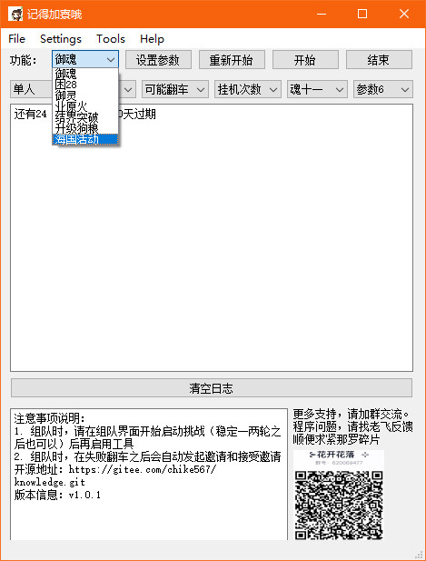

# 界面截图以及配置组合

首先我们看一下主界面窗体：  

  

## 界面说明

1. 功能列表显示的是所有支持的功能，选中任务一种进行切换
2. 参数信息，总共设置有6个参数，根据不同功能可以选择功能参数，不特地设置时会有默认值。参数看一下就能猜出来意思，不展开
3. 界面参数，显示文字以及一些注意事项可以修改 config.ini ，一般不需要动到。特别的，如果要改窗体标题也是在这边改
4. 开始，停止，启用功能和关闭功能。对应启用挂机的进程和关闭挂机的进程。因为主窗体可以传递开始和停止的信号，但是不会接收停止的信号，所以有时间点开始会提示已经启动了，这个时间可以点关闭重新复位或者点重新开始
5. 日志信息，中间的窗体是用来显示执行信息。**如果发现执行异常需要反馈时，把执行信息也一起发过来，更好去定位问题**

## 配置信息

ini文件的配置信息可以看文件 [config.ini](../../src/conf/config.ini)  

举例说明： [general]里面的信息是通用的一些信息，比如窗口标题，版本号信息，默认的提示信息等。  

```conf
[general]
title=记得加寮哦
version=v1.0.0
attention=注意事项说明：\n1. 请确认使用管理员权限运行\n2. 为方便点击，请将窗体放在阴阳师游戏窗体旁边\n3. 中途变更阴阳师窗体位置，请重新开始\n4. 工具已经尽量模拟人的操作习惯，仍有一定风险\n5. 本程序仅供学习交流。开发不易，请多支持
```

配置的解析可以参考文档： [02_ini配置文件读取](02_ini配置文件读取.md)  

我们将解析出来的数据存放在一个Config类里面：  

```python
class Config:
    def __init__(self):
        # 打开config文件，要以utf-8的方式打开，否则中文乱码
        self.config = configparser.RawConfigParser()
        self.config.read(conf_path, encoding='utf-8')
        self.general = {}
        self.yuling = {}
        self.yuhun = {}
        self.yeyuanhuo = {}
        self.chapter = {}
        self.yys_break = {}
        self.init_config()


```

我们在接口里面定义了一个全局的配置，这样调用的时候就可以直接调用：  

```python
config = Config()

# 其他文件调用时，导入之后就可以直接使用
import config
config.general['attention']
```

## 截图加载

因为脚本使用到的截图会比较多，所以按功能简单做了分类，所以设计了一个通过二层目录进行加载的函数  

```python
def open_image_list(pics):
    '''按目录层级打开相应的所有图片，并使用每个name作为key
        [
            [dir1, dir2, name1],
            [dir1, dir2, name2]
        ]
    '''
    ims = {}
    for onepath in pics:
        base_dir = screenshot_dir
        if onepath:
            key = onepath[-1]
            for relative in onepath:
                base_dir = os.path.join(base_dir, relative)
            filepatch = base_dir + '.png'

            try:
                im = Image.open(filepatch)
                # logging.debug('打开图片：{0}'.format(filepatch))
                # im.show()
                ims[key] = im
                # ims[key].show()
            except Exception as error:
                logging.error('打开图片失败，{0}, msg:{1}'.format(filepatch, error))
    return ims
```

使用示例：  

```python
if __name__ == '__main__':
    yuling_pics = [
        ['general', 'search'],  # 搜索
        ['general', 'fight'],  # P0挑战
        ['general', 'prepare'],  # P1准备
        ['general', 'victory'],  # 结算胜利
        ['general', 'fail'],  # 结算失败
        ['general', 'award'],  # 结算达摩
        ['yuling', 'layer3'],  # 选择第几层
        ['yuling', 'dragon'],  # 神龙
        ['yuling', 'fox'],  # 狐狸
        ['yuling', 'leopard'],  # 狐狸
        ['yuling', 'phenix'],  # 狐狸
    ]
    ims = open_image_list(yuling_pics)

```

细心的同学应该可以发现我没有设置路径，这个其实我也比较头疼，在考虑要不要用外部传入路径，后来还是图方便，直接写在 open_image_list() 这个函数里面，可以查看源代码了解实现  

[screenshot.py](../../src/screenshot.py)  

## 界面组合配置解析和截图加载

这个过程反而是最简单的一步了，因为我们把轮子都造好了，就剩下装到轮子上了  

参照 [图像匹配的小工具](./03_图像匹配的小工具.md) 里面的思路，我们先将界面类封到我们自己的一个界面类，并设置为 self.ui  

```python
class YysWin(QMainWindow):
    stop_run = pyqtSignal()

    def __init__(self, parent=None, win_name='阴阳师-网易游戏'):
        super(YysWin, self).__init__(parent)
        self.ui = Ui_yys_win()
        self.ui.setupUi(self)

        # 可以继承的初始化操作
        self.init_win()
```

然后再定义一个 [main.py](./main.py) 主程序，用来显示界面  

```python
import sys
from PyQt5.QtWidgets import QApplication
from mainwin import YysWin

if __name__ == '__main__':
    app = QApplication(sys.argv)
    main_win = YysWin()
    main_win.show()
    sys.exit(app.exec_())
```

剩下比较繁琐无聊的界面信号槽的函数实现就要靠慢慢调试了。具体代码参考 [mainwin.py](./mainwin.py)  

## 小结

通过之前几个内容的展开，我们的图形化界面的整个框架就已经搭好了。虽然觉得是没啥技术含量的东西，但是毕竟付出了大量的时间进行截图和调试。  
不知道这样看官们拿到源代码之后是不是都能够正常把程序跑起来。  

如果开发环境搭建起来了，可以加个寮报个信，给你打鼓助威~~。另外如果想封包成二进制文件发给其他人用，思路可以参考 [图像匹配的小工具](./03_图像匹配的小工具.md) ，这里不展开。  
本程序对应的spec文件直接看 [main.spec](../main.spec)  
