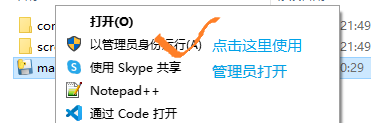

[TOC]

# 1. 阴阳师辅助帮助文档

## 1.1. 脚本结构和启用说明

一般来说，老飞没有偷懒的话，拿到的文件是一个zip的压缩包，名称一般是**yys_script.vxxx.zip**，其中vxxx是版本号。拿到之后先解压。  

最终的目录结构如下：  

其中，conf是配置信息，虽然暂时没怎么用上，但是请保留。screenshot是截图信息，必须要有。  

启用的方式如下：  

由于打开时速度较慢，所以等待一小会儿，如果有报错，请找老老反馈，或者看看常见错误中找找有没有匹配的  

如果见到如下界面即表示启用成功。  

## 1.2. 自动刷御魂功能

主要参数：  

1. 是不是队长
2. 几个人组队
3. 挂机次数
4. 魂十一

  

使用步骤（对应上图中的位置）：  

1. 选择御魂功能
2. 选择人数，默认是双人，**三人挑战时请记得切换**
3. 选择是否为队长，默认是队长，队员时需切换
4. 挂机次数，默认9999，可不选
5. 类型，默认魂十一，可不选
6. 开始自动挂机，要注意开始时机
7. 结束自动挂机，停止或者中途需要重新开始时使用

### 启动时间说明

队员比较无所谓，在庭院或者是点击庭院的探索之后进入的主地图都是可以的。  

队长的话，需要在邀请好友完成一次魂土挑战，或者是组队界面且成功手动邀请好友之后，或者是已经进行p1图，p2图，p3图之后，都是可以的。  

1. 首推是在邀请好友完成一次魂土挑战之后再启用  
2. 其次是在好友组队界面

### 注意事项

1. 队长使用八百比丘尼
2. 不是队长时，选择队员有一定优化（务必切换）
